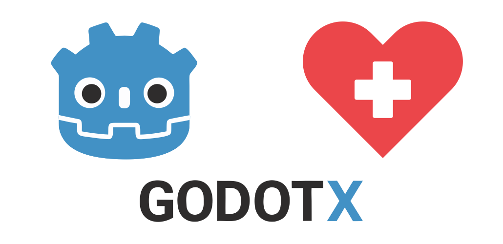

<p align="center">
    <a href="https://github.com/godot-x/health-bar-x" target="_blank" rel="noopener noreferrer">
        
    </a>
</p>

# HealthBarX

A professional shape-based health bar addon for Godot 4.5+ with full customization. Usable as a UI element (HUD) or as a 2D overlay above characters.

## Features

- **Dual usage**: HealthBarXControl (UI) and HealthBarX2D (world overlay)
- **Shape-based rendering**: Background, fill, border, shadow, and gradient drawn with 2D shapes (no textures required)
- **Value 0–100**: Internal percentage; optional min/max for display normalization
- **Full styling**: HealthBarXStyle resource (colors, roundness, fill inset, border, shadow, gradient)
- **Threshold colors**: Red / orange / green segments with configurable ranges
- **Label**: Optional; positions (Top, Bottom, Left, Right, Center Inside); format placeholders `{value}`, `{max}`, `{value}%`
- **Icon**: Optional; Texture2D or PackedScene; positions (Before, After, Above, Below, Inside Left/Right); negative offsets for overlap
- **Animation**: Optional tween on value change; duration, easing, transition; separate settings for decrease
- **World features**: Follow target (Node2D + offset), optional billboard-like constant screen size
- **Validation**: Invalid thresholds trigger `push_error` and are corrected to a safe configuration

## Installation

1. Copy the `addons/health_bar_x` folder into your Godot project.
2. Enable the plugin in **Project → Project Settings → Plugins**.
3. Add **HealthBarXControl** (UI) or **HealthBarX2D** (world) from the Add Node dialog.

## Usage

### UI (HUD)

Add a **HealthBarXControl** node under any Control (e.g. CanvasLayer or HUD). Use anchors/layout as usual. Set `value` (0–100) or use `min_value`/`max_value` and set value in that range; the bar normalizes to 0–100 for drawing.

```gdscript
var bar: HealthBarXControl = $HealthBarXControl
bar.set_value(75.0, true)   # 75%, animate
bar.set_value(50.0, false)  # 50%, no animation
var v = bar.get_value()
bar.value_change_finished.connect(func(final): print("Done: ", final))
```

### World (over-character)

Add a **HealthBarX2D** as child of your scene (or of a dedicated UI layer). Set `bar_size` (pixels), optionally set `follow_target` to a Node2D and `follow_offset` so the bar follows the character.

```gdscript
var bar: HealthBarX2D = $HealthBarX2D
bar.bar_size = Vector2(80, 14)
bar.follow_target = $Character
bar.follow_offset = Vector2(0, -40)
bar.set_value(60.0, true)
```

### Style and icon

Use a **HealthBarXStyle** resource (New Resource → HealthBarXStyle) or the node’s default; assign it to the node’s `style` property. Set colors, roundness, fill inset, border, shadow, gradient, label, icon, thresholds, and animation. **Icon**: use `icon_texture` (Texture2D) or `icon_scene` (PackedScene; root must be Control or Node2D). Set `icon_fit_mode` (Fit, Fill, Stretch). If `icon_forced_size` is zero, a default size is used so the icon stays visible when enabled.

### Animation

- `set_value(v, animate)`: when `animate` is true, value changes are tweened (duration, easing, transition in style).
- Signals: `value_change_started`, `value_changed`, `value_change_finished`.

## Demo

Open **scenes/demo/health_bar_x_demo.tscn** and run the project (or set it as main scene and press F5). The demo includes:

- **HUD section**: HealthBarXControl with value slider and controls for roundness, border, fill inset, animation, thresholds, label/icon position and offsets, shadow, gradient.
- **World section**: Simple character and HealthBarX2D above it with follow target; value and character position sliders.
- **Presets**: Classic Health Bar, Badge/Pill, Threshold Segmented, With Icon Overlap, With Label Inside, With Gradient + Shadow, No Border Flat.
- **Reset to Defaults** button.

The layout is scrollable and responsive for different resolutions and mobile.

## API summary

- **HealthBarXControl** (Control): `style`, `value`, `min_value`, `max_value`; `set_value(v, animate)`, `get_value()`; value signals.
- **HealthBarX2D** (Node2D): Same value API; `bar_size`, `follow_target`, `follow_offset`, `billboard_scale`.
- **HealthBarXStyle** (Resource): All visual and animation options; save as `.tres` and reuse.
- **HealthBarXEnums**: LabelPosition, IconPosition, GradientDirection, AnimationMode, IconFitMode.

## Performance

- Drawing is done in `_draw()`; geometry updates when size, value, or style changes.
- Shadow uses configurable blur passes; gradient uses strip overlays. Reduce shadow passes on low-end devices if needed.

## License

This project is licensed under the [MIT License](LICENSE).

---

Made with ❤️ by Paulo Coutinho
